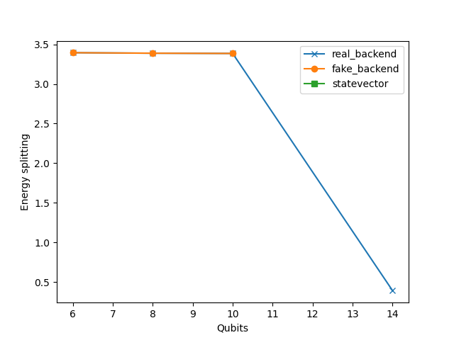

# What it this?

This repo implements an adiabatic sweep + subspace diagonalization method to compute the spectral gap of some hamiltonian $E_1-E_0$, on fake backends, using state vector, or real quantum computers.

The main script is in `src/merqury/hardware/loaded_hamiltonian_run.py`

One can plot the results in `src/merqury/utils/plots.py`

One can run `uv pip install .` to install the package and the dependencies.

# Main results

real_backend was done on the Garnet IQM device, with $n=10000$ shots. fake_backend was also provided by IQM, and emulates noise. For $N_q > 14$, only the quantum computer was used.